# τ²-Bench Architecture Design Document

---

## 1. Executive Summary

**System Purpose:** τ²-Bench is a Python benchmark framework for evaluating conversational customer service agents in dual-control environments, simulating interactions between an AI agent, a user simulator, and a domain environment across multiple domains (airline, retail, telecom).

**Key Features:**

- Multi-domain evaluation (airline, retail, telecom)
- LLM-based user simulation for realistic customer behavior
- Comprehensive evaluation across actions, communication, and environment outcomes
- Gymnasium-compatible interface for reinforcement learning
- Flexible agent and domain registry system

---

## 2. System Context

### 2.1 High-Level Overview

```mermaid
graph TB
    subgraph "External"
        LLM[☁️ LLM Providers<br/>OpenAI, Anthropic, etc.]
    end

    subgraph "τ²-Bench Core"
        CLI[🖥️ CLI Interface]
        Orchestrator[⚙️ Orchestrator]
        Agent[🤖 Agent]
        User[👤 User Simulator]
        Env[🌐 Environment]
        Eval[📊 Evaluator]
    end

    subgraph "Domains"
        Airline[✈️ Airline]
        Retail[🛒 Retail]
        Telecom[📱 Telecom]
    end

    subgraph "Data"
        Tasks[(📋 Tasks)]
        DB[(💾 Domain DB)]
        Results[(📈 Results)]
    end

    CLI --> Orchestrator
    Orchestrator --> Agent
    Orchestrator --> User
    Orchestrator --> Env
    Agent --> LLM
    User --> LLM
    Env --> Airline
    Env --> Retail
    Env --> Telecom
    Airline --> DB
    Retail --> DB
    Telecom --> DB
    Orchestrator --> Eval
    Eval --> Results

    classDef external fill:#E6E6FA,stroke:#333,stroke-width:2px,color:darkblue
    classDef core fill:#90EE90,stroke:#333,stroke-width:2px,color:darkgreen
    classDef domain fill:#FFE4B5,stroke:#333,stroke-width:2px,color:black
    classDef data fill:#87CEEB,stroke:#333,stroke-width:2px,color:darkblue

    class LLM external
    class CLI,Orchestrator,Agent,User,Env,Eval core
    class Airline,Retail,Telecom domain
    class Tasks,DB,Results data
```

---

## 3. Core Components Architecture

### 3.1 Component Overview

```mermaid
graph TB
    subgraph "CLI Layer"
        Run[tau2 run]
        Play[tau2 play]
        View[tau2 view]
        Submit[tau2 submit]
        Domain[tau2 domain]
    end

    subgraph "Orchestration Layer"
        Orch[⚙️ Orchestrator<br/>Message Router]
    end

    subgraph "Actor Layer"
        BaseAgent[🤖 BaseAgent]
        LLMAgent[LLMAgent]
        LLMSoloAgent[LLMSoloAgent]
        LLMGTAgent[LLMGTAgent]
        UserSim[👤 UserSimulator]
        DummyUser[DummyUser]
    end

    subgraph "Environment Layer"
        EnvCore[🌐 Environment]
        Toolkit[🔧 ToolKit]
        Tools[Agent Tools]
        UserTools[User Tools]
    end

    subgraph "Evaluation Layer"
        EvalCore[📊 Evaluator]
        ActionEval[ActionEvaluator]
        CommEval[CommunicateEvaluator]
        EnvEval[EnvironmentEvaluator]
    end

    subgraph "Domain Layer"
        MockDomain[Mock]
        AirlineDomain[Airline]
        RetailDomain[Retail]
        TelecomDomain[Telecom]
    end

    Run --> Orch
    Play --> Orch

    Orch --> BaseAgent
    Orch --> UserSim
    Orch --> EnvCore

    BaseAgent --> LLMAgent
    BaseAgent --> LLMSoloAgent
    BaseAgent --> LLMGTAgent

    UserSim --> DummyUser

    EnvCore --> Toolkit
    Toolkit --> Tools
    Toolkit --> UserTools

    EnvCore --> MockDomain
    EnvCore --> AirlineDomain
    EnvCore --> RetailDomain
    EnvCore --> TelecomDomain

    Orch --> EvalCore
    EvalCore --> ActionEval
    EvalCore --> CommEval
    EvalCore --> EnvEval

    classDef cli fill:#E6E6FA,stroke:#333,stroke-width:2px,color:darkblue
    classDef orch fill:#FFD700,stroke:#333,stroke-width:2px,color:black
    classDef actor fill:#90EE90,stroke:#333,stroke-width:2px,color:darkgreen
    classDef env fill:#87CEEB,stroke:#333,stroke-width:2px,color:darkblue
    classDef eval fill:#FFB6C1,stroke:#333,stroke-width:2px,color:black
    classDef domain fill:#FFE4B5,stroke:#333,stroke-width:2px,color:black

    class Run,Play,View,Submit,Domain cli
    class Orch orch
    class BaseAgent,LLMAgent,LLMSoloAgent,LLMGTAgent,UserSim,DummyUser actor
    class EnvCore,Toolkit,Tools,UserTools env
    class EvalCore,ActionEval,CommEval,EnvEval eval
    class MockDomain,AirlineDomain,RetailDomain,TelecomDomain domain
```

---

## 4. Key Workflows

### 4.1 Main Simulation Loop

The Orchestrator manages the turn-based communication protocol between Agent, User, and Environment.

```mermaid
flowchart TD
    Start([🚀 Start Simulation]) --> Init[📋 Initialize from Task]
    Init --> LoadState[💾 Load Initial State]
    LoadState --> SetHistory[📝 Set Message History]
    SetHistory --> Loop{🔄 Step Loop}

    Loop --> CheckDone{✓ Done?}
    CheckDone -->|No| Route[📨 Route Message]
    CheckDone -->|Yes| Terminate[🏁 Terminate]

    Route --> GetSender{📤 From Role?}
    GetSender -->|Agent| AgentGen[🤖 Agent Generate]
    GetSender -->|User| UserGen[👤 User Generate]
    GetSender -->|Env| EnvResp[🌐 Env Response]

    AgentGen --> ProcessMsg[⚙️ Process Message]
    UserGen --> ProcessMsg
    EnvResp --> ProcessMsg

    ProcessMsg --> UpdateState[📝 Update State]
    UpdateState --> CheckTermination{⛔ Termination?}

    CheckTermination -->|Agent Stop| Terminate
    CheckTermination -->|User Stop| Terminate
    CheckTermination -->|Max Steps| Terminate
    CheckTermination -->|Max Errors| Terminate
    CheckTermination -->|None| Loop

    Terminate --> Evaluate[📊 Evaluate]
    Evaluate --> SaveResults[💾 Save Results]
    SaveResults --> End([✅ Complete])

    classDef startEnd fill:#E6E6FA,stroke:#333,stroke-width:2px,color:darkblue
    classDef process fill:#90EE90,stroke:#333,stroke-width:2px,color:darkgreen
    classDef decision fill:#FFD700,stroke:#333,stroke-width:2px,color:black
    classDef action fill:#87CEEB,stroke:#333,stroke-width:2px,color:darkblue

    class Start,End startEnd
    class Init,LoadState,SetHistory,Route,AgentGen,UserGen,EnvResp,ProcessMsg,UpdateState,Evaluate,SaveResults,Terminate process
    class Loop,CheckDone,GetSender,CheckTermination decision
```

### 4.2 Message Flow Protocol

```mermaid
sequenceDiagram
    participant CLI as 🖥️ CLI
    participant Orch as ⚙️ Orchestrator
    participant Agent as 🤖 Agent
    participant User as 👤 User Simulator
    participant Env as 🌐 Environment

    Note over CLI,Env: Simulation Initialization
    CLI->>+Orch: run_simulation(task)
    Orch->>Orch: Initialize states

    Note over CLI,Env: Main Simulation Loop

    loop Until termination
        alt Agent's turn
            Orch->>+Agent: generate_next_message(user_msg)
            Agent->>Agent: Call LLM
            Agent-->>-Orch: AssistantMessage

            alt Has tool calls
                Orch->>+Env: get_response(tool_calls)
                Env->>Env: Execute tools
                Env-->>-Orch: ToolMessage(s)
                Orch->>Agent: Forward tool results
            else Has text content
                Orch->>User: Forward to user
            end

        else User's turn
            Orch->>+User: generate_next_message(agent_msg)
            User->>User: Call LLM
            User-->>-Orch: UserMessage

            alt Has user tool calls
                Orch->>+Env: get_response(user_tool_calls)
                Env-->>-Orch: ToolMessage(s)
                Orch->>User: Forward tool results
            else Has text content
                Orch->>Agent: Forward to agent
            end
        end
    end

    Note over CLI,Env: Termination & Evaluation
    Orch->>Orch: Evaluate trajectory
    Orch-->>-CLI: SimulationRun result
```

### 4.3 Agent Message Processing

```mermaid
flowchart TD
    Start([📥 Receive Message]) --> AddHistory[📝 Add to History]
    AddHistory --> CallLLM[☁️ Call LLM]
    CallLLM --> ParseResponse[🔍 Parse Response]

    ParseResponse --> CheckType{📋 Response Type?}

    CheckType -->|Tool Calls| CreateToolMsg[🔧 Create ToolCall Message]
    CheckType -->|Text| CreateTextMsg[💬 Create Text Message]
    CheckType -->|Stop Signal| CreateStop[🛑 Create Stop Message]

    CreateToolMsg --> ValidateTools[✓ Validate Tool Calls]
    ValidateTools --> ReturnMsg[📤 Return AssistantMessage]

    CreateTextMsg --> ReturnMsg
    CreateStop --> ReturnMsg

    ReturnMsg --> End([✅ Message Ready])

    classDef startEnd fill:#E6E6FA,stroke:#333,stroke-width:2px,color:darkblue
    classDef process fill:#90EE90,stroke:#333,stroke-width:2px,color:darkgreen
    classDef decision fill:#FFD700,stroke:#333,stroke-width:2px,color:black

    class Start,End startEnd
    class AddHistory,CallLLM,ParseResponse,CreateToolMsg,CreateTextMsg,CreateStop,ValidateTools,ReturnMsg process
    class CheckType decision
```

### 4.4 Tool Execution Flow

### 4.5 User Simulator Flow

```mermaid
flowchart TD
    Start([📥 Receive Agent Message]) --> BuildPrompt[📝 Build System Prompt]
    BuildPrompt --> AddScenario[👤 Add User Scenario]
    AddScenario --> AddInstructions[📋 Add Task Instructions]

    AddInstructions --> CallLLM[☁️ Call LLM as User]
    CallLLM --> ParseResponse[🔍 Parse Response]

    ParseResponse --> CheckStop{🛑 Stop Keywords?}

    CheckStop -->|###STOP###| StopSignal[⏹️ User Stop]
    CheckStop -->|###TRANSFER###| TransferSignal[📞 Transfer]
    CheckStop -->|###OUT-OF-SCOPE###| OOSSignal[❌ Out of Scope]
    CheckStop -->|None| FlipRole[🔄 Flip Role to User]

    FlipRole --> CheckToolCalls{🔧 Has Tool Calls?}
    CheckToolCalls -->|Yes| FlipToolCalls[🔄 Flip Tool Requestor]
    CheckToolCalls -->|No| CreateUserMsg[💬 Create UserMessage]

    FlipToolCalls --> CreateUserMsg
    StopSignal --> CreateUserMsg
    TransferSignal --> CreateUserMsg
    OOSSignal --> CreateUserMsg

    CreateUserMsg --> End([📤 Return UserMessage])

    classDef startEnd fill:#E6E6FA,stroke:#333,stroke-width:2px,color:darkblue
    classDef process fill:#90EE90,stroke:#333,stroke-width:2px,color:darkgreen
    classDef decision fill:#FFD700,stroke:#333,stroke-width:2px,color:black

    class Start,End startEnd
    class BuildPrompt,AddScenario,AddInstructions,CallLLM,ParseResponse,StopSignal,TransferSignal,OOSSignal,FlipRole,FlipToolCalls,CreateUserMsg process
    class CheckStop,CheckToolCalls decision
```

---

## 5. Evaluation System

### 5.1 Evaluation Pipeline

```mermaid
flowchart TD
    Start([📊 Start Evaluation]) --> GetTrajectory[📜 Get Message Trajectory]
    GetTrajectory --> CheckTermination{⛔ Valid Termination?}

    CheckTermination -->|Agent/User Stop| SelectEvaluators[📋 Select Evaluators]
    CheckTermination -->|Premature| ZeroReward[❌ Zero Reward]

    SelectEvaluators --> CheckBasis{📐 Reward Basis?}

    CheckBasis -->|ALL| RunAll[Run All Evaluators]
    CheckBasis -->|ENV| RunEnv[Run EnvironmentEvaluator]
    CheckBasis -->|ACTION| RunAction[Run ActionEvaluator]
    CheckBasis -->|COMMUNICATE| RunComm[Run CommunicateEvaluator]

    RunAll --> ActionEval[🎯 ActionEvaluator]
    RunAll --> CommEval[💬 CommunicateEvaluator]
    RunAll --> EnvEval[🌐 EnvironmentEvaluator]

    RunEnv --> EnvEval
    RunAction --> ActionEval
    RunComm --> CommEval

    ActionEval --> CheckActions[✓ Check Expected Actions]
    CommEval --> CheckComms[✓ Check Required Info]
    EnvEval --> CheckEnvState[✓ Check Environment State]

    CheckActions --> Aggregate[📈 Aggregate Rewards]
    CheckComms --> Aggregate
    CheckEnvState --> Aggregate

    ZeroReward --> FinalResult[📊 Final Result]
    Aggregate --> FinalResult
    FinalResult --> End([✅ Evaluation Complete])

    classDef startEnd fill:#E6E6FA,stroke:#333,stroke-width:2px,color:darkblue
    classDef process fill:#90EE90,stroke:#333,stroke-width:2px,color:darkgreen
    classDef decision fill:#FFD700,stroke:#333,stroke-width:2px,color:black
    classDef evaluator fill:#87CEEB,stroke:#333,stroke-width:2px,color:darkblue
    classDef error fill:#FFB6C1,stroke:#333,stroke-width:2px,color:black

    class Start,End startEnd
    class GetTrajectory,SelectEvaluators,RunAll,RunEnv,RunAction,RunComm,CheckActions,CheckComms,CheckEnvState,Aggregate,FinalResult process
    class CheckTermination,CheckBasis decision
    class ActionEval,CommEval,EnvEval evaluator
    class ZeroReward error
```

### 5.2 Evaluator Details

```mermaid
graph TB
    subgraph "ActionEvaluator"
        AE_Input[📜 Message Trajectory]
        AE_Extract[🔍 Extract Tool Calls]
        AE_Compare[⚖️ Compare with Expected Actions]
        AE_ArgMatch[🔧 Check Argument Matching]
        AE_Result[📊 Reward: 0.0 or 1.0]

        AE_Input --> AE_Extract
        AE_Extract --> AE_Compare
        AE_Compare --> AE_ArgMatch
        AE_ArgMatch --> AE_Result
    end

    subgraph "CommunicateEvaluator"
        CE_Input[📜 Message Trajectory]
        CE_Extract[💬 Extract Text Content]
        CE_Search[🔍 Search for Required Info]
        CE_Result[📊 Reward based on matches]

        CE_Input --> CE_Extract
        CE_Extract --> CE_Search
        CE_Search --> CE_Result
    end

    subgraph "EnvironmentEvaluator"
        EE_Input[📜 Message Trajectory]
        EE_Reconstruct[🔄 Reconstruct Environment]
        EE_RunAssertions[✓ Run env_assertions]
        EE_CheckDB[💾 Check DB State]
        EE_Result[📊 Combined Reward]

        EE_Input --> EE_Reconstruct
        EE_Reconstruct --> EE_RunAssertions
        EE_RunAssertions --> EE_CheckDB
        EE_CheckDB --> EE_Result
    end

    classDef input fill:#E6E6FA,stroke:#333,stroke-width:2px,color:darkblue
    classDef process fill:#90EE90,stroke:#333,stroke-width:2px,color:darkgreen
    classDef result fill:#FFD700,stroke:#333,stroke-width:2px,color:black

    class AE_Input,CE_Input,EE_Input input
    class AE_Extract,AE_Compare,AE_ArgMatch,CE_Extract,CE_Search,EE_Reconstruct,EE_RunAssertions,EE_CheckDB process
    class AE_Result,CE_Result,EE_Result result
```

---

## 6. Domain Structure

### 6.1 Domain Architecture

### 6.2 Toolkit Pattern

```mermaid
flowchart TD
    Start([🔧 Define Tool]) --> Decorator["@is_tool decorator"]
    Decorator --> MarkMethod[Mark method as tool]
    MarkMethod --> SetType[Set tool type:<br/>READ/WRITE/THINK/GENERIC]

    SetType --> Discovery[🔍 Auto-Discovery]
    Discovery --> CollectTools[Collect all @is_tool methods]
    CollectTools --> ConvertSchema[Convert to Tool objects]
    ConvertSchema --> RegisterTools[Register in ToolKit]

    RegisterTools --> Ready([✅ Tools Ready])

    subgraph "Tool Execution"
        Call([📞 Tool Call]) --> FindTool[Find tool by name]
        FindTool --> MapArgs[Map arguments to params]
        MapArgs --> Execute[Execute method]
        Execute --> ReturnResult[Return result]
    end

    Ready --> Call

    classDef startEnd fill:#E6E6FA,stroke:#333,stroke-width:2px,color:darkblue
    classDef process fill:#90EE90,stroke:#333,stroke-width:2px,color:darkgreen
    classDef exec fill:#FFE4B5,stroke:#333,stroke-width:2px,color:black

    class Start,Ready,Call startEnd
    class Decorator,MarkMethod,SetType,Discovery,CollectTools,ConvertSchema,RegisterTools process
    class FindTool,MapArgs,Execute,ReturnResult exec
```

---

## 7. Agent Execution Modes

### 7.1 Execution Mode Comparison

```mermaid
graph LR
    subgraph "Standard Mode"
        S_Agent[🤖 LLMAgent]
        S_User[👤 UserSimulator]
        S_Env[🌐 Environment]

        S_Agent <-->|Conversation| S_User
        S_Agent <-->|Tool Calls| S_Env
        S_User <-->|User Tools| S_Env
    end

    subgraph "Solo Mode"
        Solo_Agent[🤖 LLMSoloAgent]
        Solo_Dummy[⬜ DummyUser]
        Solo_Env[🌐 Environment]

        Solo_Agent -->|Tool Calls Only| Solo_Env
        Solo_Agent -.->|No Interaction| Solo_Dummy
    end

    subgraph "GT Mode"
        GT_Agent[🤖 LLMGTAgent]
        GT_User[👤 UserSimulator]
        GT_Env[🌐 Environment]

        GT_Agent <-->|Guided by Expected Actions| GT_User
        GT_Agent <-->|Tool Calls| GT_Env
    end

    classDef agent fill:#90EE90,stroke:#333,stroke-width:2px,color:darkgreen
    classDef user fill:#87CEEB,stroke:#333,stroke-width:2px,color:darkblue
    classDef env fill:#FFE4B5,stroke:#333,stroke-width:2px,color:black
    classDef dummy fill:#E0E0E0,stroke:#333,stroke-width:2px,color:gray

    class S_Agent,Solo_Agent,GT_Agent agent
    class S_User,GT_User user
    class S_Env,Solo_Env,GT_Env env
    class Solo_Dummy dummy
```

### 7.2 Solo Mode Workflow

```mermaid
sequenceDiagram
    participant CLI as 🖥️ CLI
    participant Orch as ⚙️ Orchestrator
    participant Agent as 🤖 LLMSoloAgent
    participant Env as 🌐 Environment

    CLI->>+Orch: run_simulation(task, solo_mode=True)
    Orch->>Agent: Initialize with ticket in system prompt
    Note over Agent: System prompt contains:<br/>- Domain policy<br/>- Task ticket description<br/>- Special "done" tool

    loop Until done
        Orch->>+Agent: generate_next_message()
        Agent->>Agent: Generate tool calls only

        alt Regular tool calls
            Agent-->>-Orch: AssistantMessage(tool_calls)
            Orch->>+Env: Execute tools
            Env-->>-Orch: ToolMessage(s)
            Orch->>Agent: Forward results

        else "done" tool call
            Agent-->>Orch: AssistantMessage(done tool)
            Orch->>Orch: Mark as STOP
        end
    end

    Orch->>Orch: Evaluate
    Orch-->>-CLI: SimulationRun result
```

---

## 8. Data Models

### 8.1 Message Type Hierarchy

### 8.2 Task Data Model

---

## 9. Registry System

### 9.1 Registration Flow

---

## 10. Gymnasium Integration

### 10.1 Gym Agent Interface

```mermaid
sequenceDiagram
    participant RL as 🤖 RL Algorithm
    participant GymEnv as 🎮 GymAgent
    participant Orch as ⚙️ Orchestrator
    participant Agent as 🤖 Agent
    participant User as 👤 User

    RL->>+GymEnv: reset()
    GymEnv->>+Orch: Initialize simulation
    Orch-->>-GymEnv: Initial state
    GymEnv-->>-RL: observation, info

    loop Training Episode
        RL->>+GymEnv: step(action)
        GymEnv->>+Orch: Apply action

        alt Agent mode
            Orch->>+Agent: generate_next_message(action)
            Agent-->>-Orch: Response
        else User mode
            Orch->>+User: generate_next_message(action)
            User-->>-Orch: Response
        end

        Orch-->>-GymEnv: New state
        GymEnv->>GymEnv: Calculate reward
        GymEnv-->>-RL: observation, reward, terminated, truncated, info
    end

    RL->>GymEnv: close()
```

---

## 11. CLI Commands

### 11.1 Command Flow

---

## 12. Configuration & Settings

### 12.1 Configuration Hierarchy

```mermaid
graph TB
    subgraph "Configuration Sources"
        Defaults[⚙️ config.py Defaults]
        EnvVars[🌍 Environment Variables]
        DotEnv[📄 .env File]
        CLI[🖥️ CLI Arguments]
    end

    subgraph "Key Settings"
        MaxSteps[MAX_STEPS = 200]
        MaxConcurrency[MAX_CONCURRENCY = 3]
        CacheEnabled[LLM_CACHE_ENABLED = False]
        LiteLLM[LiteLLM Provider Config]
    end

    subgraph "LLM Configuration"
        APIKeys[API Keys]
        ModelIDs[Model IDs]
        Parameters[Temperature, etc.]
    end

    Defaults --> MaxSteps
    Defaults --> MaxConcurrency
    Defaults --> CacheEnabled

    EnvVars --> APIKeys
    DotEnv --> APIKeys
    CLI --> ModelIDs
    CLI --> Parameters

    APIKeys --> LiteLLM
    ModelIDs --> LiteLLM
    Parameters --> LiteLLM

    classDef source fill:#E6E6FA,stroke:#333,stroke-width:2px,color:darkblue
    classDef setting fill:#90EE90,stroke:#333,stroke-width:2px,color:darkgreen
    classDef llm fill:#FFE4B5,stroke:#333,stroke-width:2px,color:black

    class Defaults,EnvVars,DotEnv,CLI source
    class MaxSteps,MaxConcurrency,CacheEnabled,LiteLLM setting
    class APIKeys,ModelIDs,Parameters llm
```

---

## 13. End-to-End Simulation Flow

### 13.1 Complete Execution Sequence

```mermaid
sequenceDiagram
    actor Developer as 👨‍💻 Developer
    participant CLI as 🖥️ CLI
    participant Registry as 📦 Registry
    participant Orch as ⚙️ Orchestrator
    participant Agent as 🤖 Agent
    participant User as 👤 User Simulator
    participant Env as 🌐 Environment
    participant LLM as ☁️ LLM Provider
    participant Eval as 📊 Evaluator
    participant FS as 💾 File System

    Developer->>+CLI: tau2 run --domain airline --agent-llm gpt-4.1

    Note over CLI,FS: Initialization Phase
    CLI->>+Registry: get_domain("airline")
    Registry-->>-CLI: Environment factory
    CLI->>+Registry: get_agent("llm_agent")
    Registry-->>-CLI: Agent class
    CLI->>+Registry: get_user("llm_user")
    Registry-->>-CLI: User class
    CLI->>+Registry: get_tasks("airline")
    Registry-->>-CLI: Task list

    Note over CLI,FS: Simulation Phase (per task)
    loop For each task
        CLI->>+Orch: create_simulation(task, agent, user, env)
        Orch->>Env: Initialize environment state
        Orch->>Agent: Set system prompt with policy
        Orch->>User: Set scenario instructions

        loop Simulation steps
            alt Agent turn
                Orch->>+Agent: generate_next_message()
                Agent->>+LLM: Chat completion request
                LLM-->>-Agent: Response
                Agent-->>-Orch: AssistantMessage

                opt Tool calls present
                    Orch->>+Env: Execute tool calls
                    Env-->>-Orch: Tool results
                end

            else User turn
                Orch->>+User: generate_next_message()
                User->>+LLM: Chat completion request
                LLM-->>-User: Response
                User-->>-Orch: UserMessage
            end
        end

        Note over CLI,FS: Evaluation Phase
        Orch->>+Eval: evaluate(trajectory, criteria)
        Eval->>Eval: Run ActionEvaluator
        Eval->>Eval: Run CommunicateEvaluator
        Eval->>Eval: Run EnvironmentEvaluator
        Eval-->>-Orch: Rewards & metrics

        Orch-->>-CLI: SimulationRun result
    end

    Note over CLI,FS: Output Phase
    CLI->>+FS: Save results JSON
    FS-->>-CLI: Saved
    CLI-->>-Developer: Display summary metrics
```

---

## 14. Summary

τ²-Bench provides a comprehensive framework for evaluating conversational AI agents in customer service scenarios. Key architectural highlights:

| Component          | Purpose                 | Key Features                                   |
|--------------------|-------------------------|------------------------------------------------|
| **Orchestrator**   | Message routing         | Turn-based protocol, termination handling      |
| **Agent**          | Response generation     | LLM-powered, multiple modes (standard/solo/GT) |
| **User Simulator** | Customer simulation     | Scenario-driven, LLM-based responses           |
| **Environment**    | Domain state & tools    | Toolkit pattern, dual tool sets                |
| **Evaluator**      | Performance measurement | Action, communication, environment checks      |
| **Registry**       | Component discovery     | Flexible agent/domain registration             |
| **Gym Interface**  | RL integration          | Gymnasium-compatible API                       |

The modular design enables easy extension with new domains, agents, and evaluation criteria while maintaining consistent simulation semantics.

---

**Related Files:**

- [src/tau2/orchestrator/](../src/tau2/orchestrator/) - Orchestrator implementation
- [src/tau2/agent/](../src/tau2/agent/) - Agent implementations
- [src/tau2/domains/](../src/tau2/domains/) - Domain implementations
- [data/tau2/domains/](../data/tau2/domains/) - Domain data files
