# tau2-bench Leaderboard UI - Architecture Design Document

**Author:** tau2-bench Team
**Date:** 2025-01-20
**Status:** Approved
**Version:** 1.0

---

## 1. Executive Summary

The tau2-bench Leaderboard UI is a lightweight, static React application for displaying and exploring benchmark results from the tau2-bench evaluation framework. It provides interactive visualization of model performance metrics, trajectory exploration, and task analysis across multiple domains (airline, retail, telecom).

**Business Context:**

- Display benchmark results for conversational customer service agents
- Enable researchers to compare model performance across domains
- Provide transparency into evaluation trajectories and task definitions
- Support community contributions via leaderboard submissions

**Key Decisions:**

- Static-first architecture (no backend required)
- Hash-based routing for GitHub Pages compatibility
- Component-scoped state management (no centralized store)
- Chart.js for performance visualization

---

## 2. System Context

### 2.1 System Overview

The Leaderboard UI serves as the public-facing interface for the tau2-bench benchmark, enabling users to explore model rankings, compare performance metrics, and examine execution trajectories.

```mermaid
graph TB
    subgraph "Users"
        Researcher["👤 Researcher"]
        Developer["👤 Developer"]
        Contributor["👤 Contributor"]
    end

    subgraph "tau2-bench Leaderboard UI"
        WebApp["🌐 React SPA"]
    end

    subgraph "Static Data Sources"
        Submissions["📦 Submission JSON Files"]
        TaskData["📋 Task Definitions"]
        Trajectories["📜 Trajectory Logs"]
        Policies["📝 Domain Policies"]
    end

    subgraph "External"
        GitHub["🐙 GitHub Pages"]
        CDN["📡 Chart.js CDN"]
    end

    Researcher --> WebApp
    Developer --> WebApp
    Contributor --> WebApp

    WebApp --> Submissions
    WebApp --> TaskData
    WebApp --> Trajectories
    WebApp --> Policies

    GitHub --> WebApp
    CDN --> WebApp

    classDef user fill:#E8F5E9,stroke:#2E7D32,stroke-width:2px,color:#1B5E20
    classDef app fill:#E3F2FD,stroke:#1565C0,stroke-width:2px,color:#0D47A1
    classDef data fill:#FFF3E0,stroke:#EF6C00,stroke-width:2px,color:#E65100
    classDef external fill:#F3E5F5,stroke:#7B1FA2,stroke-width:2px,color:#4A148C

    class Researcher,Developer,Contributor user
    class WebApp app
    class Submissions,TaskData,Trajectories,Policies data
    class GitHub,CDN external
```

### 2.2 Stakeholders

| Stakeholder           | Role         | Interest                                               |
|-----------------------|--------------|--------------------------------------------------------|
| ML Researchers        | Primary User | Compare model performance, analyze trajectories        |
| Developers            | Primary User | Understand benchmark structure, contribute submissions |
| Benchmark Maintainers | Operator     | Update leaderboard, verify submissions                 |
| Open Source Community | Contributor  | Submit new model results, suggest improvements         |

---

## 3. Requirements

### 3.1 Functional Requirements

| ID   | Requirement                                                  | Priority |
|------|--------------------------------------------------------------|----------|
| FR-1 | Display model rankings with Pass^k metrics                   | High     |
| FR-2 | Filter results by domain (overall, retail, airline, telecom) | High     |
| FR-3 | Visualize performance trends via charts                      | High     |
| FR-4 | Explore execution trajectories for submissions               | Medium   |
| FR-5 | Browse task definitions and policies                         | Medium   |
| FR-6 | Distinguish standard vs custom submissions                   | Medium   |
| FR-7 | Deep-link to specific views via URL                          | Low      |

### 3.2 Non-Functional Requirements

| Category        | Requirement         | Target                        |
|-----------------|---------------------|-------------------------------|
| Performance     | Initial load time   | < 2 seconds                   |
| Scalability     | Support submissions | 100+ models                   |
| Accessibility   | Mobile responsive   | All screen sizes              |
| Deployment      | Static hosting      | GitHub Pages compatible       |
| Browser Support | Modern browsers     | Chrome, Firefox, Safari, Edge |

---

## 4. Architecture Overview

### 4.1 Architectural Style

**Single Page Application (SPA) with Static Data:**

The application follows a static-first architecture where all data is pre-generated JSON files served alongside the application. There is no backend server - all processing happens client-side.

**Why this style:**

- Zero operational overhead (no servers to maintain)
- GitHub Pages deployment (free, reliable hosting)
- Fast initial load (data co-located with app)
- Easy contribution workflow (submit JSON files via PR)

### 4.2 High-Level Architecture

```mermaid
graph TB
    subgraph "Browser"
        subgraph "React Application"
            App["📱 App.jsx<br/>Router & Navigation"]

            subgraph "Views"
                Home["🏠 Home View"]
                LB["📊 Leaderboard"]
                TV["🔍 TrajectoryVisualizer"]
            end

            subgraph "Shared"
                State["💾 Component State"]
                Storage["🗄️ localStorage"]
            end
        end

        ChartJS["📈 Chart.js"]
    end

    subgraph "Static Assets /public"
        Manifest["📋 manifest.json"]
        SubFiles["📦 submissions/*.json"]
        TaskFiles["📝 task-data/*.json"]
        TrajFiles["📜 trajectories/*.json"]
    end

    App --> Home
    App --> LB
    App --> TV

    LB --> State
    LB --> Storage
    LB --> ChartJS

    TV --> State

    LB -.fetch.-> Manifest
    LB -.fetch.-> SubFiles
    TV -.fetch.-> SubFiles
    TV -.fetch.-> TaskFiles
    TV -.fetch.-> TrajFiles

    classDef router fill:#BBDEFB,stroke:#1565C0,stroke-width:2px,color:#0D47A1
    classDef view fill:#C8E6C9,stroke:#2E7D32,stroke-width:2px,color:#1B5E20
    classDef shared fill:#FFE0B2,stroke:#EF6C00,stroke-width:2px,color:#E65100
    classDef lib fill:#E1BEE7,stroke:#7B1FA2,stroke-width:2px,color:#4A148C
    classDef data fill:#FFECB3,stroke:#FF8F00,stroke-width:2px,color:#E65100

    class App router
    class Home,LB,TV view
    class State,Storage shared
    class ChartJS lib
    class Manifest,SubFiles,TaskFiles,TrajFiles data
```

---

## 5. Component Design

### 5.1 Component Hierarchy

### 5.2 Component Descriptions

#### App.jsx (Root Component)

- **Purpose:** Main orchestrator for routing and navigation
- **Responsibilities:** Hash-based routing, mobile menu toggle, view rendering
- **Technologies:** React 19, CSS
- **Dependencies:** All view components

#### Leaderboard.jsx

- **Purpose:** Display model performance rankings and metrics
- **Responsibilities:** Load submissions, render table/chart, handle filtering/sorting
- **Technologies:** React, Chart.js, localStorage
- **Dependencies:** Static submission JSON files

#### TrajectoryVisualizer.jsx

- **Purpose:** Explore execution trajectories and task definitions
- **Responsibilities:** Browse trajectories, display conversations, show task details
- **Technologies:** React
- **Dependencies:** Submission files, trajectory files, task data files

---

## 6. Data Architecture

### 6.1 Data Model

### 6.2 Data Flow - Leaderboard

```mermaid
flowchart LR
    subgraph "Data Loading"
        A["🚀 Component Mount"] --> B["📋 Fetch manifest.json"]
        B --> C["📦 Parallel fetch<br/>all submission.json"]
        C --> D["⚙️ Transform &<br/>Calculate Averages"]
    end

    subgraph "State Management"
        D --> E["💾 setPassKData"]
        E --> F{"📊 View Mode?"}
    end

    subgraph "Rendering"
        F -->|Table| G["🗂️ Render Table<br/>with Sorting"]
        F -->|Chart| H["📈 Initialize<br/>Chart.js"]
    end

    subgraph "User Interactions"
        I["🖱️ Filter Change"] --> J["🔄 Re-filter Data"]
        J --> F
        K["🖱️ Sort Click"] --> L["🔄 Re-sort Data"]
        L --> G
        M["🖱️ Model Click"] --> N["📋 Show Modal"]
    end

    classDef load fill:#E3F2FD,stroke:#1565C0,stroke-width:2px,color:#0D47A1
    classDef state fill:#E8F5E9,stroke:#2E7D32,stroke-width:2px,color:#1B5E20
    classDef render fill:#FFF3E0,stroke:#EF6C00,stroke-width:2px,color:#E65100
    classDef interact fill:#F3E5F5,stroke:#7B1FA2,stroke-width:2px,color:#4A148C

    class A,B,C,D load
    class E,F state
    class G,H render
    class I,J,K,L,M,N interact
```

### 6.3 Data Flow - Trajectory Visualizer

```mermaid
flowchart TB
    subgraph "Mode Selection"
        Start["🚀 Component Mount"] --> Mode{"📂 View Mode?"}
    end

    subgraph "Trajectories Path"
        Mode -->|Trajectories| T1["📋 Load Submissions"]
        T1 --> T2["🖱️ Select Submission"]
        T2 --> T3["🔍 HEAD requests<br/>probe trajectory files"]
        T3 --> T4["📜 Load Trajectory JSON"]
        T4 --> T5["💬 Display Conversation<br/>limit: 60 messages"]
    end

    subgraph "Tasks Path"
        Mode -->|Tasks| K1["🗂️ Select Domain"]
        K1 --> K2["📝 Fetch tasks.json<br/>limit: 50 tasks"]
        K2 --> K3["📜 Fetch policy.md"]
        K3 --> K4["🖱️ Select Task"]
        K4 --> K5["📋 Show Task Detail<br/>+ Policy + Results"]
    end

    classDef mode fill:#BBDEFB,stroke:#1565C0,stroke-width:2px,color:#0D47A1
    classDef traj fill:#C8E6C9,stroke:#2E7D32,stroke-width:2px,color:#1B5E20
    classDef task fill:#FFE0B2,stroke:#EF6C00,stroke-width:2px,color:#E65100

    class Start,Mode mode
    class T1,T2,T3,T4,T5 traj
    class K1,K2,K3,K4,K5 task
```

---

## 7. Routing Architecture

### 7.1 Hash-Based Navigation

### 7.2 URL Structure

| Route                    | View                 | Description                     |
|--------------------------|----------------------|---------------------------------|
| `#home`                  | Home                 | Landing page with hero and news |
| `#leaderboard`           | Leaderboard          | Model rankings and metrics      |
| `#trajectory-visualizer` | TrajectoryVisualizer | Trajectory and task explorer    |
| `(empty)`                | Home                 | Redirects to #home              |

---

## 8. User Interactions

### 8.1 Leaderboard User Journey

### 8.2 Trajectory Explorer User Journey

### 8.3 Task Browser User Journey

---

## 9. State Management

### 9.1 State Architecture

### 9.2 localStorage Keys

| Key               | Type    | Component   | Description                               |
|-------------------|---------|-------------|-------------------------------------------|
| `leaderboardView` | string  | Leaderboard | 'table' or 'chart'                        |
| `domain`          | string  | Leaderboard | 'overall', 'retail', 'airline', 'telecom' |
| `sortColumn`      | string  | Leaderboard | 'pass1', 'pass2', 'pass3', 'pass4'        |
| `sortDirection`   | string  | Leaderboard | 'asc' or 'desc'                           |
| `showStandard`    | boolean | Leaderboard | Show standard submissions                 |
| `showCustom`      | boolean | Leaderboard | Show custom submissions                   |

---

## 10. Deployment Architecture

### 10.1 Build & Deploy Pipeline

```mermaid
flowchart LR
    subgraph "Development"
        Dev["👨‍💻 Developer"]
        Code["📝 Source Code"]
    end

    subgraph "Build Process"
        Vite["⚡ Vite Build"]
        Dist["📦 dist/"]
    end

    subgraph "Deployment"
        GHPages["🐙 GitHub Pages"]
        CDN["🌐 CDN"]
    end

    subgraph "Runtime"
        Browser["🖥️ User Browser"]
    end

    Dev --> Code
    Code --> Vite
    Vite --> Dist
    Dist --> GHPages
    GHPages --> Browser
    CDN --> Browser

    classDef dev fill:#E3F2FD,stroke:#1565C0,stroke-width:2px,color:#0D47A1
    classDef build fill:#E8F5E9,stroke:#2E7D32,stroke-width:2px,color:#1B5E20
    classDef deploy fill:#FFF3E0,stroke:#EF6C00,stroke-width:2px,color:#E65100
    classDef runtime fill:#F3E5F5,stroke:#7B1FA2,stroke-width:2px,color:#4A148C

    class Dev,Code dev
    class Vite,Dist build
    class GHPages,CDN deploy
    class Browser runtime
```

### 10.2 File Structure (Production)

---

## 11. Performance Optimizations

### 11.1 Optimization Strategies

```mermaid
graph TB
    subgraph "Data Loading"
        Lazy["🔄 Lazy Loading<br/>Fetch on demand"]
        Parallel["⚡ Parallel Fetches<br/>Promise.all()"]
        Limit["📉 Data Limiting<br/>50 tasks, 60 messages"]
    end

    subgraph "Rendering"
        Conditional["🎯 Conditional Render<br/>View mode switching"]
        ChartMgmt["📊 Chart Management<br/>Destroy/recreate"]
        LocalStore["💾 localStorage<br/>Persist preferences"]
    end

    subgraph "Network"
        HEAD["🔍 HEAD Requests<br/>Probe file existence"]
        Static["📦 Static Assets<br/>CDN caching"]
        Bundle["📦 Vite Bundling<br/>Code splitting"]
    end

    classDef load fill:#E3F2FD,stroke:#1565C0,stroke-width:2px,color:#0D47A1
    classDef render fill:#E8F5E9,stroke:#2E7D32,stroke-width:2px,color:#1B5E20
    classDef network fill:#FFF3E0,stroke:#EF6C00,stroke-width:2px,color:#E65100

    class Lazy,Parallel,Limit load
    class Conditional,ChartMgmt,LocalStore render
    class HEAD,Static,Bundle network
```

### 11.2 Performance Targets

| Metric       | Target  | Strategy              |
|--------------|---------|-----------------------|
| Initial Load | < 2s    | Vite bundling, CDN    |
| Data Fetch   | < 1s    | Parallel requests     |
| View Switch  | < 100ms | Conditional rendering |
| Chart Render | < 500ms | Canvas optimization   |
| Mobile Menu  | < 50ms  | CSS transitions       |

---

## 12. Technology Stack

### 12.1 Stack Overview

```mermaid
graph TB
    subgraph "Frontend"
        React["⚛️ React 19"]
        CSS["🎨 CSS 3"]
        ChartJS["📊 Chart.js"]
    end

    subgraph "Build & Dev"
        Vite["⚡ Vite 7"]
        ESLint["📝 ESLint 9"]
        npm["📦 npm"]
    end

    subgraph "Deployment"
        GHPages["🐙 gh-pages"]
        GitHub["🐙 GitHub Actions"]
    end

    subgraph "Data Format"
        JSON["📄 JSON"]
        Markdown["📝 Markdown"]
    end

    React --> Vite
    CSS --> Vite
    ChartJS --> React
    Vite --> GHPages
    ESLint --> Vite
    npm --> Vite

    classDef frontend fill:#61DAFB,stroke:#20232A,stroke-width:2px,color:#20232A
    classDef build fill:#646CFF,stroke:#1A1A2E,stroke-width:2px,color:white
    classDef deploy fill:#24292E,stroke:#1A1A2E,stroke-width:2px,color:white
    classDef data fill:#F7DF1E,stroke:#1A1A2E,stroke-width:2px,color:#1A1A2E

    class React,CSS,ChartJS frontend
    class Vite,ESLint,npm build
    class GHPages,GitHub deploy
    class JSON,Markdown data
```

### 12.2 Dependencies

| Package              | Version | Purpose                 |
|----------------------|---------|-------------------------|
| react                | ^19.1.0 | UI framework            |
| react-dom            | ^19.1.0 | DOM rendering           |
| vite                 | ^7.0.4  | Build tool & dev server |
| @vitejs/plugin-react | ^4.6.0  | Vite React plugin       |
| chart.js             | CDN     | Charting library        |
| gh-pages             | ^6.1.1  | GitHub Pages deployment |
| eslint               | ^9.30.1 | Code linting            |

---

## 13. Decision Log

### ADR-001: Static-First Architecture

**Date:** 2024-01-01
**Status:** Accepted

**Context:**
The leaderboard needs to display benchmark results without requiring a backend server for cost and maintenance reasons.

**Decision:**
Use static JSON files served alongside the React application, with all data processing happening client-side.

**Consequences:**

- Positive: Zero operational cost, simple deployment, no server maintenance
- Positive: GitHub Pages compatible, enables PR-based submission workflow
- Negative: Limited to client-side data processing
- Negative: No real-time updates (requires rebuild for new data)

### ADR-002: Hash-Based Routing

**Date:** 2024-01-01
**Status:** Accepted

**Context:**
Need client-side routing that works with static file hosting (GitHub Pages) without server-side configuration.

**Decision:**
Implement hash-based routing using `window.location.hash` instead of React Router.

**Consequences:**

- Positive: Works on any static host without server configuration
- Positive: Supports browser back/forward navigation
- Positive: Enables deep-linking to specific views
- Negative: URLs contain `#` (less clean than path-based routing)
- Negative: No library support (manual implementation)

### ADR-003: Component-Scoped State

**Date:** 2024-01-01
**Status:** Accepted

**Context:**
Need state management for view preferences, filters, and loaded data.

**Decision:**
Use React hooks (useState, useEffect) with localStorage for persistence instead of a centralized state management library.

**Consequences:**

- Positive: Lightweight, no additional dependencies
- Positive: Clear data ownership per component
- Positive: User preferences persist across sessions
- Negative: No state sharing between components
- Negative: localStorage sync adds some complexity

---

## 14. Appendices

### Glossary

| Term                | Definition                                                      |
|---------------------|-----------------------------------------------------------------|
| Pass^k              | Success rate metric where k attempts are allowed per task       |
| Trajectory          | Complete execution trace of agent-user-environment interactions |
| Domain              | Benchmark category (retail, airline, telecom)                   |
| Standard Submission | Uses default scaffold with unmodified prompts                   |
| Custom Submission   | Uses modified scaffold (multi-model, custom tools, etc.)        |

### References

1. [tau2-bench Repository](https://github.com/tau2-bench)
2. [React Documentation](https://react.dev)
3. [Vite Documentation](https://vite.dev)
4. [Chart.js Documentation](https://www.chartjs.org/docs)
5. [GitHub Pages Documentation](https://pages.github.com)
