# High-Level Design: Trajectory Comments Feature

**Author:** IRL
**Date:** 2025-01-20
**Status:** Approved
**Version:** 0.2

**References:**

- [Intent and Constraints](./intent-and-constraints.md)
- [ADR-Lite](./adr-lite.md)
- [Architecture Overview](../ARCHITECTURE.md)

---

## 1. Overview

This document describes the high-level design for adding commenting functionality to the τ²-bench Leaderboard UI's Trajectory Visualizer. The feature enables users to annotate simulation trajectories with comments that are stored as files in the repository, enabling git-based collaboration and conflict-free merging.

### 1.1 Design Principles

1. **Non-intrusive:** Comments should not interfere with the primary trajectory viewing experience
2. **Simple:** One comment stream per simulation, users reference turns in free-form text
3. **Git-mergeable:** Per-user file isolation enables conflict-free collaboration
4. **Consistent:** Match existing visual patterns and interaction models

---

## 2. System Context

```mermaid
graph TB
    subgraph "Browser (React App)"
        subgraph "TrajectoryVisualizer"
            ConvView[("Conversation View")]
            CommentPanel[("💬 Comment Panel")]
            CommentBtn[("🗨️ Floating Button")]
        end

        subgraph "Comment System"
            CommentState[("Comment State")]
            UseComments[("useComments Hook")]
        end
    end

    subgraph "Vite Dev Server"
        API[("Comments API<br/>/api/comments/*")]
    end

    subgraph "File System (Repository)"
        CommentFiles[("📁 comments/<br/>{user}/*.json")]
    end

    subgraph "Git Workflow"
        GitCommit[("git commit")]
        GitPush[("git push/pull")]
    end

    ConvView --> CommentBtn
    CommentBtn --> CommentPanel
    CommentPanel --> CommentState
    CommentState --> UseComments
    UseComments -->|"fetch/POST"| API
    API -->|"read/write"| CommentFiles
    CommentFiles --> GitCommit
    GitCommit --> GitPush

    classDef existing fill:#E3F2FD,stroke:#1565C0,stroke-width:2px
    classDef new fill:#C8E6C9,stroke:#2E7D32,stroke-width:2px
    classDef server fill:#FFE0B2,stroke:#EF6C00,stroke-width:2px
    classDef storage fill:#F3E5F5,stroke:#7B1FA2,stroke-width:2px

    class ConvView existing
    class CommentPanel,CommentBtn,CommentState,UseComments new
    class API server
    class CommentFiles,GitCommit,GitPush storage
```



---

## 3. Component Architecture

### 3.1 Component Hierarchy


### 3.2 Component Descriptions

| Component                 | Purpose                                        | Location                                        |
|---------------------------|------------------------------------------------|-------------------------------------------------|
| **CommentFloatingButton** | Floating button with comment count badge       | Fixed position, right edge of conversation view |
| **CommentPanel**          | Slide-out panel containing comments            | Slides in from right when button clicked        |
| **CommentList**           | Renders list of existing comments (all users)  | Inside CommentPanel                             |
| **CommentItem**           | Single comment with edit/delete (own only)     | Inside CommentList                              |
| **CommentForm**           | Input form for new/editing comments            | Inside CommentPanel                             |
| **useComments**           | Custom hook for comment CRUD + file API        | Shared by button and panel                      |
| **useUsername**           | Hook to get/set current git username           | Used for author identification                  |

---

## 4. Data Architecture

### 4.1 File Storage Structure

```text
web/leaderboard/public/submissions/
└── {submission-dir}/
    └── trajectories/
        ├── {trajectory-file}.json          # Existing trajectory data
        └── comments/
            └── {git-username}/
                └── {trajectory-stem}_{simulation-id}.json
```

**Example:**

```text
submissions/claude-3-7-sonnet_anthropic_2024-06-20/trajectories/
├── claude-3-7-sonnet-20250219_retail_default_gpt-4.1-2025-04-14_4trials.json
└── comments/
    ├── pdhoolia/
    │   └── claude-3-7-sonnet-20250219_retail_default_gpt-4.1-2025-04-14_4trials_task42_trial0.json
    └── jsmith/
        └── claude-3-7-sonnet-20250219_retail_default_gpt-4.1-2025-04-14_4trials_task42_trial0.json
```

### 4.2 Comment Data Model


### 4.3 Comment File Schema

```typescript
// Single user's comments for a specific simulation
interface CommentFile {
  version: 1;
  author: string;           // Git username (file owner)
  simulationKey: string;    // Reference to simulation
  comments: Comment[];
}

interface Comment {
  id: string;               // UUID v4
  text: string;             // Comment content (may reference turns)
  timestamp: string;        // ISO 8601 creation date
  edited: boolean;          // True if modified after creation
  editedAt?: string;        // ISO 8601 edit date (if edited)
}
```

### 4.4 Why Per-User Files Enable Conflict-Free Merging

```text
User A commits:                    User B commits:
comments/userA/sim_task1.json      comments/userB/sim_task1.json

Git merge result:
comments/userA/sim_task1.json  ✅ No conflict (different files)
comments/userB/sim_task1.json  ✅ No conflict (different files)
```

---

## 5. Backend API Design

Since the webapp runs locally via Vite dev server, we add a simple API middleware to handle file operations.

### 5.1 API Endpoints

| Method | Endpoint                                                           | Description                                   |
|--------|--------------------------------------------------------------------|-----------------------------------------------|
| GET    | `/api/comments/{submission}/{trajectory}/{simulation}`             | Get all comments (aggregated from all users)  |
| GET    | `/api/comments/{submission}/{trajectory}/{simulation}/{user}`      | Get specific user's comments                  |
| POST   | `/api/comments/{submission}/{trajectory}/{simulation}`             | Add new comment (creates/updates user's file) |
| PUT    | `/api/comments/{submission}/{trajectory}/{simulation}/{commentId}` | Edit comment (user's own only)                |
| DELETE | `/api/comments/{submission}/{trajectory}/{simulation}/{commentId}` | Delete comment (user's own only)              |
| GET    | `/api/username`                                                    | Get current git username                      |
| PUT    | `/api/username`                                                    | Override username for session                 |

### 5.2 API Implementation (Vite Plugin)

```javascript
// vite.config.js - Custom middleware for comments API
export default defineConfig({
  plugins: [
    react(),
    {
      name: 'comments-api',
      configureServer(server) {
        server.middlewares.use('/api/comments', commentsHandler);
        server.middlewares.use('/api/username', usernameHandler);
      }
    }
  ]
});
```

---

## 6. Data Flow

### 6.1 Load Comments Flow (Aggregated from All Users)


### 6.2 Add Comment Flow


### 6.3 Edit/Delete Flow


---

## 7. UI Layout

### 7.1 Floating Button Placement

```text
┌──────────────────────────────────────────────────────────┐
│ ← Back to Simulations    Task 6 - Trial 0 Conversation   │
├──────────────────────────────────────────────────────────┤
│                                                          │
│  ┌────────────────────────────────────────────────────┐  │
│  │ Task Context                                       │  │
│  │ Purpose: ...                                       │  │
│  │ User Scenario: ...                                 │  │
│  └────────────────────────────────────────────────────┘  │
│                                                          │
│  ┌────────────────────────────────────────────────────┐  │
│  │ Simulation Results                                 │  │
│  │ Overall Reward: 1.00  | Termination: user_stop    │  │
│  └────────────────────────────────────────────────────┘  │
│                                                      ┌──┐│
│  ┌──────────────────────────────────────────────┐   │💬││
│  │ 🤖 Agent  Turn 0  ...                        │   │ 5││  ← Badge shows total
│  │ Hi! How can I help you today?                │   └──┘│    from all users
│  └──────────────────────────────────────────────┘       │
│                                                          │
└──────────────────────────────────────────────────────────┘
```

### 7.2 Expanded Comment Panel

```text
┌──────────────────────────────────────────┬───────────────────────────┐
│ ← Back to Simulations    Task 6 - ...    │  💬 Comments (5)     ✕    │
├──────────────────────────────────────────┼───────────────────────────┤
│                                          │  Viewing as: pdhoolia 👤  │
│  ┌────────────────────────────────────┐  │───────────────────────────│
│  │ Task Context                       │  │                           │
│  │ Purpose: ...                       │  │  ┌───────────────────────┐│
│  └────────────────────────────────────┘  │  │ pdhoolia              ││
│                                          │  │ Jan 20, 2025 10:30 AM ││
│  ┌────────────────────────────────────┐  │  │ Turn 2: Agent should  ││
│  │ Simulation Results                 │  │  │ have asked for email  ││
│  │ Reward: 1.00  | Term: user_stop    │  │  │ first.          ✏️ 🗑️ ││
│  └────────────────────────────────────┘  │  └───────────────────────┘│
│                                          │                           │
│  ┌────────────────────────────────────┐  │  ┌───────────────────────┐│
│  │ 🤖 Agent  Turn 0  ...              │  │  │ jsmith                ││
│  │ Hi! How can I help you today?      │  │  │ Jan 20, 2025 11:15 AM ││
│  └────────────────────────────────────┘  │  │ Great handling of the ││
│                                          │  │ edge case!            ││
│  ┌────────────────────────────────────┐  │  └───────────────────────┘│
│  │ 👤 User  Turn 1  ...               │  │  ↑ No edit/delete (not   │
│  │ Hi! I'd like to exchange...        │  │    your comment)         │
│  └────────────────────────────────────┘  │                           │
│                                          │  ┌───────────────────────┐│
│                                          │  │ Add a comment...      ││
│                                          │  │ ┌───────────────────┐ ││
│                                          │  │ │ Comment text...   │ ││
│                                          │  │ └───────────────────┘ ││
│                                          │  │        [Add Comment]  ││
│                                          │  └───────────────────────┘│
└──────────────────────────────────────────┴───────────────────────────┘
```

---

## 8. State Management

### 8.1 useComments Hook Interface

```typescript
interface UseCommentsReturn {
  comments: Comment[];           // All comments (all users)
  count: number;                 // Total count
  isLoading: boolean;
  error: string | null;
  currentUser: string;           // Current git username
  addComment: (text: string) => Promise<void>;
  editComment: (id: string, text: string) => Promise<void>;
  deleteComment: (id: string) => Promise<void>;
  canEdit: (comment: Comment) => boolean;  // True if user owns comment
  refresh: () => Promise<void>;  // Re-fetch after git pull
}

function useComments(simulationKey: string | null): UseCommentsReturn;
```

### 8.2 useUsername Hook Interface

```typescript
interface UseUsernameReturn {
  username: string | null;
  isLoading: boolean;
  error: string | null;
  setUsername: (name: string) => void;  // Override for session
}

function useUsername(): UseUsernameReturn;
```

---

## 9. Technology Choices

| Decision         | Choice                            | Rationale                         |
|------------------|-----------------------------------|-----------------------------------|
| State management | React hooks (useState, useEffect) | Matches existing architecture     |
| Persistence      | File system via Vite middleware   | Git-mergeable, version controlled |
| API layer        | Vite plugin middleware            | No separate server, dev-only      |
| UUID generation  | crypto.randomUUID()               | Built-in, no dependencies         |
| Panel animation  | CSS transitions                   | Lightweight, performant           |
| Username source  | git config user.name              | Automatic, no login required      |

---

## 10. File Structure

```text
web/leaderboard/
├── src/
│   ├── components/
│   │   ├── TrajectoryVisualizer.jsx    (modified)
│   │   ├── TrajectoryVisualizer.css    (modified)
│   │   └── comments/
│   │       ├── CommentFloatingButton.jsx
│   │       ├── CommentPanel.jsx
│   │       ├── CommentList.jsx
│   │       ├── CommentItem.jsx
│   │       ├── CommentForm.jsx
│   │       └── Comments.css
│   └── hooks/
│       ├── useComments.js
│       └── useUsername.js
├── server/
│   └── commentsApi.js              (Vite middleware)
├── vite.config.js                  (modified)
└── public/submissions/
    └── {submission}/trajectories/comments/   (created at runtime)
```

---

## 11. Error Handling

| Scenario                      | Handling                                             |
|-------------------------------|------------------------------------------------------|
| File read error               | Show error in panel, allow retry                     |
| File write error              | Show error toast, keep comment in form               |
| Username not configured       | Prompt user to set username                          |
| Comment file corrupted        | Log error, skip corrupted file, continue with others |
| Empty comment text            | Disable submit button, show validation message       |
| Edit/delete non-owned comment | API returns 403, UI shows error                      |

---

## 12. Resolved Design Questions

All open questions have been resolved via ADR-Lite:

1. **Panel width:** Fixed 320px width (See [ADR-009](./adr-lite.md#adr-009-fixed-panel-width-320px))

2. **Animation direction:** Panel overlays content, does not push (See [ADR-008](./adr-lite.md#adr-008-panel-overlay-not-push))

3. **Comment ordering:** Chronological, oldest first (See [ADR-007](./adr-lite.md#adr-007-comment-ordering---chronological-oldest-first))

4. **Refresh on focus:** Not implemented initially (manual refresh button provided)

5. **Username persistence:** Override stored in localStorage (See [ADR-010](./adr-lite.md#adr-010-username-stored-in-localstorage-for-session-persistence))

---

## 13. Git Workflow Integration

### 13.1 Typical User Workflow

```text
1. User runs `npm run dev` to start leaderboard locally
2. User browses trajectories, adds comments
3. Comments saved to: public/submissions/.../comments/{username}/*.json
4. User runs `git add . && git commit -m "Add trajectory comments"`
5. User pushes to shared repo
6. Team member pulls, sees all comments aggregated in UI
```

### 13.2 Merge Scenario

```text
Main branch has:
  comments/alice/task1.json

Feature branch A adds:
  comments/bob/task1.json

Feature branch B adds:
  comments/charlie/task1.json

Merge result (no conflicts):
  comments/alice/task1.json
  comments/bob/task1.json
  comments/charlie/task1.json
```

---

## 14. Future Considerations

These are explicitly out of scope but the design should not preclude:

1. **Production deployment:** Could add a backend API that reads/writes to same file structure
2. **Comment threading:** Schema includes ID that could support parent_id for replies
3. **Export/import:** JSON format is portable, could export all comments as single file
4. **Rich text:** Text field could later support markdown rendering
5. **Reactions:** Could add reactions array to Comment schema

---

## Appendix A: Mermaid Diagram Summary

| Diagram             | Section | Purpose                                             |
|---------------------|---------|-----------------------------------------------------|
| System Context      | 2       | Shows browser, server, and file system relationship |
| Component Hierarchy | 3.1     | Visualizes component tree                           |
| Data Model          | 4.2     | ER diagram of comment file structure                |
| Load Flow           | 6.1     | Sequence diagram for loading aggregated comments    |
| Add Flow            | 6.2     | Sequence diagram for adding comments                |
| Edit/Delete Flow    | 6.3     | Sequence diagram for modifications                  |
